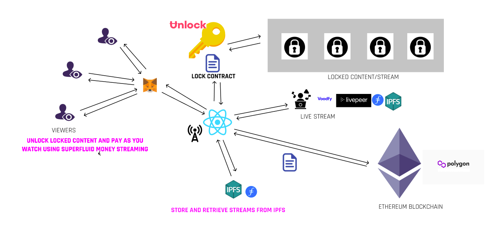
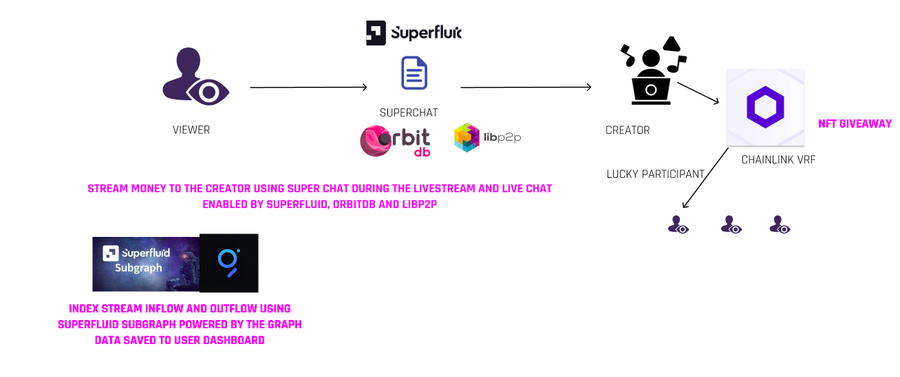
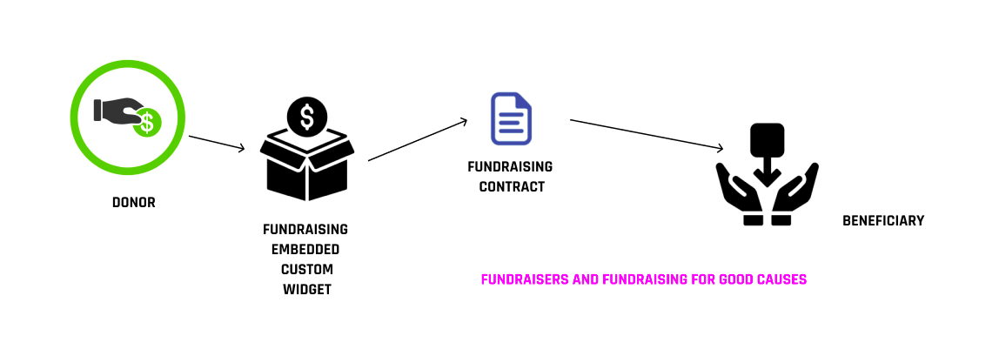

<h1 align="center">NiftySubs - Your Decentralized Live Streaming Platform</h1>

  
  <h6>Built at ETHGlobal HackMoney 2021</h6>
  
  

## _With a pay-as-you-use model, you can now watch your favorite creators at minimal cost only on NiftySubs_

    <a href="https://www.niftysubs.com/">View Demo</a>
    ·
    <a href="https://github.com/NiftySubs/niftysubs/issues">Report Bug</a>
    ·
    <a href="https://github.com/NiftySubs/niftysubs/issues">Request Feature</a>
  

##  Features

 ✔️ Pay-as-you-watch, cheapest video streaming experience. 

 ✔️ Superchat feature, show love tour favorite creators and get your message highlighted! 

 ✔️ Creators can do NFT giveaways to viewers!  

 ✔️ Broswe through old streams by your favorite creators. 

 ✔️ Donate money to a creator or raise money for a cause using our custom widget-embed hassle free 

 ✔️ Customized dashboard for creators as a one access place for their statistics. 

 
 **A lot more to come!**

## Architecture

### Built With
We have used the following technologies for this project:
* [Solidity](https://docs.soliditylang.org/en/v0.8.3/) (Language for writing smart contracts of the Dapp)
* [Chainlink](https://chain.link/) (For selecting the winner of NFT from the list of viewers!)
* [Filecoin](https://filecoin.io/) (Voodify service for the persistence of video and transmissions)
* [Infura](https://infura.io/) (Connect to the blockchain to provide event list widget to the creators)
* [IPFS](https://ipfs.io/) (IPFS PubSub for chat feature and orbitdb for storing data)
* [Superfluid](https://www.superfluid.finance/) (Superfluid CFA to enable the pay-as-you-use feature)
* [Ʉnlock Protocol](https://unlock-protocol.com/)(Unlock lets is easily lock and manage access to our monetized content on NiftySubs.)
* [Metamask](https://metamask.io) (Wallet Provider)
* [The Graph](https://thegraph.com/) (Query historical events to provide info on our dapp to both the creators and viewers)
* [OrbitDB](https://orbitdb.org/) (For storing metadata about the video and creator profile information and pubsub live chat)
* [Tailwind](https://tailwind.com) (CSS framework)
* [ReactJS](https://reactjs.org/) (web UI)

## Getting Started

* Clone the repo:

`git clone https://github.com/NiftySubs/niftysubs.git && cd niftysubs`

### Run the Project

Once you are in the project directory nstall the required dependencies using a package manager `yarn` or `npm`.

`yarn add` or `npm install`

`yarn start` or `npm start`

Runs the app in the development mode.
Open [http://localhost:3000](http://localhost:3000) to view it in the browser.

<!-- # Getting Started with Create React App

This project was bootstrapped with [Create React App](https://github.com/facebook/create-react-app).

## Available Scripts

In the project directory, you can run:

### `npm start`

Runs the app in the development mode.\
Open [http://localhost:3000](http://localhost:3000) to view it in the browser.

The page will reload if you make edits.\
You will also see any lint errors in the console.

### `npm test`

Launches the test runner in the interactive watch mode.\
See the section about [running tests](https://facebook.github.io/create-react-app/docs/running-tests) for more information.

### `npm run build`

Builds the app for production to the `build` folder.\
It correctly bundles React in production mode and optimizes the build for the best performance.

The build is minified and the filenames include the hashes.\
Your app is ready to be deployed!

See the section about [deployment](https://facebook.github.io/create-react-app/docs/deployment) for more information.

### `npm run eject`

**Note: this is a one-way operation. Once you `eject`, you can’t go back!**

If you aren’t satisfied with the build tool and configuration choices, you can `eject` at any time. This command will remove the single build dependency from your project.

Instead, it will copy all the configuration files and the transitive dependencies (webpack, Babel, ESLint, etc) right into your project so you have full control over them. All of the commands except `eject` will still work, but they will point to the copied scripts so you can tweak them. At this point you’re on your own.

You don’t have to ever use `eject`. The curated feature set is suitable for small and middle deployments, and you shouldn’t feel obligated to use this feature. However we understand that this tool wouldn’t be useful if you couldn’t customize it when you are ready for it.

## Learn More

You can learn more in the [Create React App documentation](https://facebook.github.io/create-react-app/docs/getting-started).

To learn React, check out the [React documentation](https://reactjs.org/).

### Code Splitting

This section has moved here: [https://facebook.github.io/create-react-app/docs/code-splitting](https://facebook.github.io/create-react-app/docs/code-splitting)

### Analyzing the Bundle Size

This section has moved here: [https://facebook.github.io/create-react-app/docs/analyzing-the-bundle-size](https://facebook.github.io/create-react-app/docs/analyzing-the-bundle-size)

### Making a Progressive Web App

This section has moved here: [https://facebook.github.io/create-react-app/docs/making-a-progressive-web-app](https://facebook.github.io/create-react-app/docs/making-a-progressive-web-app)

### Advanced Configuration

This section has moved here: [https://facebook.github.io/create-react-app/docs/advanced-configuration](https://facebook.github.io/create-react-app/docs/advanced-configuration)

### Deployment

This section has moved here: [https://facebook.github.io/create-react-app/docs/deployment](https://facebook.github.io/create-react-app/docs/deployment)

### `npm run build` fails to minify

This section has moved here: [https://facebook.github.io/create-react-app/docs/troubleshooting#npm-run-build-fails-to-minify](https://facebook.github.io/create-react-app/docs/troubleshooting#npm-run-build-fails-to-minify) -->
